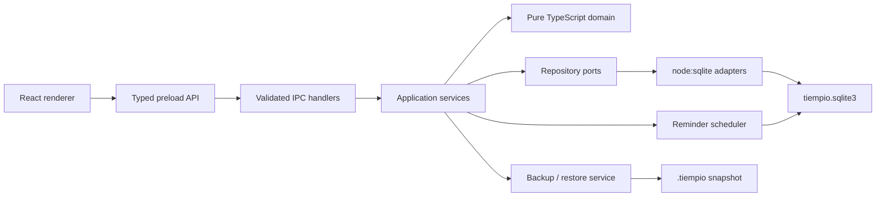

# Tiempio — архитектура MVP

**Статус:** принято для начала Этапа 1  
**Этап:** 0  
**Платформа:** Windows first, macOS-compatible  
**Связанные контракты:** `I18N.md`, `../QUALITY.md`,
`../design/UI-DIRECTION.md`

## 1. Архитектурные цели

- local-first приложение без аккаунта и сервера;
- один надёжный источник пользовательских данных;
- renderer без доступа к Node.js, SQL и файловой системе;
- явные типизированные контракты между процессами;
- простой стек без нативных сторонних SQLite-модулей;
- миграции и резервные копии до появления реальных пользовательских данных;
- полная локализация `ru`, `en` и `es` с первого пользовательского экрана;
- возможность тестировать доменные правила без Electron и React.

## 2. Слои

### Renderer

Отвечает только за представление, локальное состояние формы и запросы через
узкий preload API.

Renderer не получает:

- объект `ipcRenderer`;
- SQL;
- путь к базе;
- произвольный файловый API;
- Node.js-модули.

### Граница локализации

Tiempio использует тот же типобезопасный подход, который уже проверен в Yinkie,
без дополнительной runtime-зависимости:

- `InterfaceLocale = 'system' | 'ru' | 'en' | 'es'`;
- `ResolvedInterfaceLocale = 'ru' | 'en' | 'es'`;
- эталонный каталог задаёт union допустимых ключей;
- каталоги `ru`, `en` и `es` обязаны иметь одинаковые ключи и параметры;
- React получает `locale` и функцию `t` через `LocalizationProvider`;
- общие переводчик и каталоги доступны renderer и main process.

В компонентах запрещён пользовательский текст строковыми литералами. Компоненты
используют ключи, именованные параметры и готовые сообщения целиком; предложения
не собираются конкатенацией переведённых фрагментов.

Даты, время, относительные интервалы, списки и множественное число форматируются
через `Intl.DateTimeFormat`, `Intl.RelativeTimeFormat`, `Intl.ListFormat` и
`Intl.PluralRules`. Доменная модель хранит ISO-даты, минуты и стабильные enum-коды
и не зависит от выбранного языка.

Локализуются:

- renderer и accessibility labels;
- меню Electron и системные диалоги;
- трей и локальные уведомления;
- сообщения ошибок, пустые состояния и подтверждения.

Пользовательский контент — названия и описания задач, проектов и тегов — не
переводится. Смена языка обновляет интерфейс без перезапуска и не изменяет
пользовательские сущности.

Настройка `System` распознаёт русские и испанские системные locale, а для
остальных использует английский. Первый день недели остаётся понедельником по
продуктовому правилу, а не вычисляется из locale.

В quality gate входят:

- статический `i18n:audit`, запрещающий непереведённый пользовательский текст;
- тест точного совпадения ключей и параметров трёх каталогов;
- тесты plural rules и форматирования дат для `ru`, `en` и `es`;
- проверка интерфейса с длинными испанскими строками.

### Preload

Экспортирует по одному типизированному методу на разрешённую операцию, например:

- `tasks.list(query)`;
- `tasks.create(command)`;
- `tasks.update(command)`;
- `projects.list()`;
- `backup.create()`.

Он не экспортирует универсальные `send`, `invoke`, названия каналов или объект
Electron целиком.

### Main process

Владеет:

- IPC;
- application services;
- репозиториями;
- SQLite-соединением;
- системным треем;
- уведомлениями;
- диалогами выбора файла;
- резервным копированием и восстановлением.

### Application services

IPC вызывает только `SettingsApplication` и `TaskApplication`. Эти
application-интерфейсы возвращают `Promise` и не знают о SQLite, Electron или
конкретном способе хранения. Реализации `SettingsApplicationService` и
`TaskApplicationService` координируют use cases через repository ports.

Эта граница позволяет будущему web-клиенту сохранить домен и use-case API,
заменив desktop transport и storage adapters.

### Repository ports

`SettingsRepositoryPort` и `TaskRepositoryPort` находятся в shared TypeScript и
принимают только DTO из общего контракта. SQLite-адаптеры реализуют эти ports в
main process. IPC не импортирует и не принимает конкретные SQLite-классы.

Ports поддерживают синхронные и асинхронные адаптеры через `Awaitable`, тогда как
application services всегда предоставляют асинхронный интерфейс. Это сохраняет
быстрый синхронный `node:sqlite` на desktop и не блокирует IndexedDB, OPFS или
HTTP-адаптер в будущей web-версии.

### Domain

Чистый TypeScript без Electron, React и SQL. Домен принимает значения и часы как
зависимости, возвращает результат или типизированную ошибку.

## 3. Решение по хранилищу

### Решение

Использовать SQLite через встроенный модуль `node:sqlite`, доступный в Node,
поставляемом с Electron 43.

Electron 43 поставляется с Node 24.17/24.18. В Node 24.18 `node:sqlite` имеет
статус release candidate, предоставляет синхронный `DatabaseSync`, foreign keys,
defensive mode и штатную асинхронную функцию `sqlite.backup()`.

Официальные источники:

- [Electron 43 stack changes](https://www.electronjs.org/blog/electron-43-0);
- [Node 24.18 SQLite API](https://nodejs.org/download/release/latest-v24.x/docs/api/sqlite.html);
- [Electron security checklist](https://www.electronjs.org/docs/latest/tutorial/security);
- [Electron context isolation](https://www.electronjs.org/docs/latest/tutorial/context-isolation).

### Почему SQLite

- задачи, проекты и теги естественно образуют связи;
- фильтрация и календарные диапазоны эффективно выражаются запросами;
- транзакции защищают связанные изменения;
- миграции имеют понятную последовательность;
- штатный backup API создаёт согласованный снимок активной базы;
- один файл удобно переносить между компьютерами.

### Почему не JSON

Один JSON-файл прост в начале, но усложняет:

- атомарные изменения нескольких сущностей;
- many-to-many связи тегов;
- выборки по диапазонам;
- защиту от частичной записи;
- миграции;
- рост истории и напоминаний.

### Почему не IndexedDB

IndexedDB перенесла бы владение данными в renderer/browser-контекст, усложнила
резервное копирование и сделала границу доступа к пользовательским данным менее
явной.

### Риск release candidate

`node:sqlite` изолируется за собственными repository-интерфейсами. До реализации
функций продукта Этап 1 обязан доказать в packaged Windows-сборке:

- модуль доступен;
- база создаётся и повторно открывается;
- транзакции и foreign keys работают;
- backup создаётся и восстанавливается;
- приложение не требует внешнего нативного бинарника.

Electron и Node фиксируются точными версиями. Если packaged-smoke контракт не
выполнен, меняется только SQLite-адаптер, а не домен или UI.

## 4. Размещение данных

Основная база:

`app.getPath('userData')/tiempio.sqlite3`

Рядом могут находиться только технические SQLite-файлы WAL и внутренние
предмиграционные снимки. Пользовательские проекты не создают собственных файлов
и папок.

Настройки хранятся в той же базе. Поэтому пользовательская резервная копия
содержит данные и настройки в одном файле.

После смены рабочего имени приложение не создаёт молча пустой профиль вместо
существующих данных. Если новая база отсутствует, startup adapter находит
предыдущий профиль, создаёт SQLite snapshot во временный файл нового `userData`,
проверяет его через `quick_check` и атомарно устанавливает как
`tiempio.sqlite3`. Существующая новая база никогда не перезаписывается, а
исходный файл остаётся recovery-копией.

## 5. Открытие базы

Базовые параметры `DatabaseSync`:

- `readOnly: false`;
- `enableForeignKeyConstraints: true`;
- `enableDoubleQuotedStringLiterals: false`;
- `allowExtension: false`;
- `defensive: true`;
- ограниченный `timeout` ожидания блокировки.

После открытия:

- `PRAGMA journal_mode = WAL`;
- `PRAGMA synchronous = FULL`;
- проверка версии схемы;
- применение миграций;
- подготовка только заранее известных statements.

SQL-параметры всегда связываются через prepared statements. Пользовательские
значения не конкатенируются в SQL.

## 6. Синхронный API

`DatabaseSync` выполняет операции синхронно. Для персональной локальной базы это
приемлемо при следующих ограничениях:

- одно соединение;
- короткие подготовленные запросы;
- ограниченные календарные диапазоны;
- никаких полных сканирований в частом UI-пути;
- пакетные записи внутри одной транзакции;
- резервное копирование через отдельный async backup API;
- измерение самых тяжёлых запросов на реалистичном наборе данных.

Worker или utility process не вводится заранее. Он добавляется только если
измерения показывают заметную блокировку main process.

## 7. Транзакции

Одна пользовательская команда является одной транзакцией, если меняет несколько
строк.

Примеры:

- задача + теги + activity event;
- смена статуса + `planned_for_date` или `completed_at`;
- серия + слоты + теги;
- архивация проекта и обновление его revision.

Repository не открывает вложенные транзакции самостоятельно. Границей транзакции
владеет application service.

## 8. Миграции

### Таблица

`schema_migrations`:

- `version` — последовательное целое число;
- `name` — стабильное имя;
- `checksum` — контроль неизменности;
- `applied_at` — UTC-момент применения.

### Правила

- миграции только вперёд;
- применённый файл миграции не редактируется;
- каждая миграция по возможности выполняется одной транзакцией;
- перед первой новой миграцией создаётся внутренний backup;
- при ошибке транзакция откатывается, исходная база остаётся доступной;
- база с неизвестной более новой версией не открывается на запись;
- production rollback выполняется восстановлением backup, а не down-миграцией.

### Проверки

Тесты миграций запускаются для:

- пустой базы;
- каждой поддерживаемой старой версии;
- актуальной базы без изменений;
- повреждённой базы;
- базы с более новой неизвестной схемой;
- повторного запуска после прерванного обновления.

## 9. Резервная копия

### Формат

Пользователь получает один файл:

`Tiempio-backup-YYYY-MM-DD.tiempio`

Внутри это согласованный SQLite-снимок с таблицей метаданных:

- версия формата backup;
- версия схемы;
- версия приложения;
- время создания;
- платформа.

Отдельный ZIP и дополнительная библиотека архивирования не нужны.

### Создание

1. Пользователь выбирает место через системный Save dialog.
2. Записи application service кратко ставятся в очередь.
3. `sqlite.backup()` создаёт снимок во временный файл рядом с назначением.
4. Снимок открывается read-only и проходит `quick_check` и проверку метаданных.
5. Временный файл атомарно заменяет выбранный `.tiempio`.
6. Очередь записей возобновляется.

Незавершённый или непроверенный файл не объявляется успешной копией.

### Восстановление

1. Файл открывается read-only без изменения текущей базы.
2. Проверяются формат, версия, структура и `quick_check`.
3. Более новая неподдерживаемая версия отклоняется с понятным сообщением.
4. Создаётся страховочная копия текущей базы.
5. SQLite-соединение закрывается.
6. Проверенный файл атомарно устанавливается как новая база.
7. Выполняются допустимые миграции и повторная проверка.
8. При любой ошибке восстанавливается предыдущая база.

Restore никогда не объединяет две базы. Это восстановление снимка, а не sync.

## 10. IPC и безопасность

Зафиксированы:

- `contextIsolation: true`;
- `nodeIntegration: false`;
- sandbox для renderer;
- локальный custom protocol вместо `file://` в production;
- Content Security Policy;
- валидация sender каждого привилегированного IPC;
- runtime-валидация всех входных payload;
- запрет произвольной навигации и новых окон;
- allowlist схем для открытия пользовательских ссылок;
- Electron fuses перед релизом.

Каждая IPC-ошибка преобразуется в стабильный код, а не передаёт renderer сырой
stack trace или системный путь.

## 11. Контракты команд

Renderer передаёт commands с примитивными сериализуемыми значениями:

- строки;
- числа;
- boolean;
- массивы и простые объекты;
- `LocalDate`, `LocalTime` и ISO timestamps как строки.

`Date`, class instances, SQLite rows и Error objects через bridge не передаются.

Изменяющая команда содержит:

- ID сущности;
- ожидаемый `revision`;
- только разрешённые поля.

Main повторно валидирует команду, независимо от клиентской валидации формы.

## 12. Обновление интерфейса

После успешной команды application service возвращает новую DTO с увеличенным
`revision`. Renderer обновляет локальный cache.

Если изменение влияет на несколько представлений, main отправляет узкое событие
инвалидации без Electron event object. Renderer перечитывает нужный запрос.

Не используется глобальная двусторонняя синхронизация всего состояния.

## 13. Ошибки и восстановление

Минимальные доменные коды:

- `VALIDATION_FAILED`;
- `NOT_FOUND`;
- `REVISION_CONFLICT`;
- `STORAGE_BUSY`;
- `STORAGE_CORRUPT`;
- `MIGRATION_FAILED`;
- `BACKUP_INVALID`;
- `BACKUP_TOO_NEW`;
- `REMINDER_PERMISSION_DENIED`.

Сообщения пользователю локализуются в renderer по коду. Техническая причина
пишется в локальный диагностический журнал без названий и описаний задач.

Если сообщение создаёт main process — например, уведомление или системный
диалог, — он локализует тот же код через общий каталог. Через IPC не передаются
готовые англоязычные сообщения.

## 14. Границы производительности

Repository-запросы обязаны:

- принимать явный диапазон или лимит;
- не загружать старые `Done` без запроса пользователя;
- вычислять календарные экземпляры только для видимого диапазона;
- не материализовывать бесконечные повторения;
- использовать индексы для board/project/calendar queries.

Тестовый набор перед MVP: не менее десяти тысяч конечных задач, нескольких сотен
проектов и тегов и нескольких лет календарного диапазона повторений.

Цель теста — отсутствие зависаний и доказательство ограниченности алгоритмов, а
не обещание корпоративного масштаба.

## 15. Обязательные архитектурные проверки Этапа 1

- repository policy: UTF-8 без BOM, LF и final newline;
- `.gitattributes` и `.editorconfig` согласованы с Prettier;
- `format:check`, ESLint и отсутствие непреднамеренного format drift;
- отдельные typecheck для main/preload и renderer;
- pre-commit hook запускает полный `npm run precommit`;
- pre-commit выполняет изолированный чистый `npm ci` по committed lockfile;
- dependency audit требует `0 high / 0 critical` для production tree и
  блокирует новые high/critical tooling advisory;
- clean-checkout gate: `npm ci --no-audit` и `npm run quality`;
- packaged smoke для `node:sqlite` на Windows;
- repository contract tests на временной реальной базе;
- atomic transaction tests;
- migration matrix;
- backup/restore round trip;
- corrupt/newer backup rejection;
- IPC payload validation;
- sender validation;
- renderer без Node.js;
- CSP и navigation policy;
- отсутствие путей и SQL в renderer DTO;
- закрытие базы при штатном завершении приложения.
