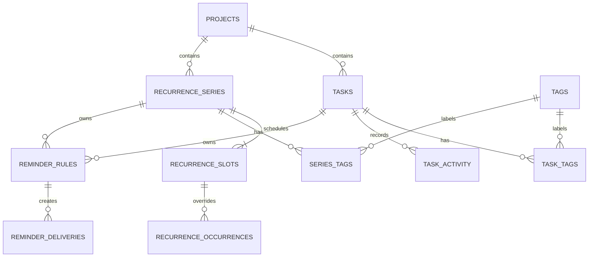

# Tiempio — логическая модель данных

**Статус:** принято для MVP  
**Этап:** 0  
**Область:** пользовательские данные, правила дат, срочность и повторения

## 1. Цели модели

Модель должна:

- хранить одну задачу без дублирования между Today, Week и Month;
- детерминированно рассчитывать старт, срочность и перенос на следующий день;
- отделять конечные задачи от бесконечных повторяющихся событий;
- поддерживать один проект и любое число тегов у задачи;
- сохранять историю, необходимую для будущего weekly review;
- не зависеть от React, Electron IPC или конкретной SQLite-библиотеки;
- допускать безопасные миграции без потери пользовательских данных.

## 2. Базовые типы

### Идентификаторы

Все пользовательские сущности получают UUID, созданный приложением. ID не несёт
порядка сортировки; порядок всегда задаётся отдельным полем.

### LocalDate

Календарная дата хранится строкой `YYYY-MM-DD` без часового пояса.

Она используется для:

- дедлайна;
- желательного старта;
- даты планирования на сегодня;
- границ повторяющейся серии;
- даты отдельного повторения.

`LocalDate` нельзя преобразовывать в полночь UTC через обычный JavaScript `Date`,
потому что это может сдвинуть календарный день.

### LocalTime

Время события хранится строкой `HH:mm` в локальном времени пользователя.
Поддержка событий, жёстко привязанных к другому часовому поясу, не входит в MVP.

### Instant

Технические моменты времени хранятся в UTC в формате ISO 8601:

- создание;
- изменение;
- завершение;
- архивация;
- доставка напоминания.

## 3. Связи

`REMINDER_RULES` принадлежит либо задаче, либо повторяющейся серии, но никогда
обоим одновременно.

## 4. Конечные задачи

### 4.1. Поля `tasks`

| Поле                   | Смысл                                               |
| ---------------------- | --------------------------------------------------- |
| `id`                   | UUID                                                |
| `title`                | Обязательное непустое название                      |
| `description`          | Опциональный текст                                  |
| `status`               | `todo`, `planned`, `in_progress`, `done`            |
| `estimate_days`        | Целое число дней, минимум `1`                       |
| `due_date`             | Обязательный `LocalDate`                            |
| `preferred_start_date` | Обязательный вычисленный или ручной `LocalDate`     |
| `start_mode`           | `auto` или `manual`                                 |
| `planned_for_date`     | День, когда задача была помещена в `Plan for today` |
| `scheduled_time`       | Опциональный `LocalTime`                            |
| `project_id`           | Опциональная ссылка на один проект                  |
| `archived_at`          | Момент скрытия задачи из активных представлений     |
| `completed_at`         | Момент завершения                                   |
| `revision`             | Версия для защиты от конфликтующих изменений        |
| `created_at`           | Момент создания                                     |
| `updated_at`           | Момент последнего изменения                         |

### 4.2. Старт

При `start_mode = auto`:

`preferred_start_date = due_date − estimate_days + 1 календарный день`

Изменение оценки или дедлайна автоматически пересчитывает старт.

При `start_mode = manual` старт меняется только пользователем. Ручной старт не
может быть позже дедлайна. Зона риска всё равно рассчитывается из оценки и
дедлайна, а не из оптимистично выбранного ручного старта.

### 4.3. Статусные инварианты

- При входе в `planned` записывается текущая локальная дата в
  `planned_for_date`.
- Пока задача остаётся в `planned`, дата не переписывается в полночь.
- При выходе из `planned` поле `planned_for_date` очищается.
- Для `done` поле `completed_at` обязательно.
- Для остальных статусов `completed_at` равно `null`.
- Повторное открытие выполненной задачи очищает `completed_at`.
- Архивная задача не показывается на доске и в календаре, но остаётся в базе.

Задача считается перенесённой, если:

`status = planned` и `planned_for_date < today`

### 4.4. Срочность

Срочность вычисляется доменной функцией, а не хранится отдельным изменяемым
полем.

Для незавершённых задач:

1. `due_today` — дедлайн сегодня;
2. `overdue` — дедлайн раньше сегодня;
3. `at_risk` — последний безопасный старт наступил, дедлайн ещё впереди;
4. `upcoming` — запас времени остаётся.

Последний безопасный старт:

`latest_safe_start = due_date − estimate_days + 1 календарный день`

Задача находится в зоне риска, если:

`today >= latest_safe_start` и `today < due_date`

Внутри категории сортировка выполняется по дедлайну, затем по `created_at`, затем
по `id` для стабильного результата.

Для `done` сортировка выполняется по `completed_at` от нового к старому.

## 5. Проекты

### 5.1. Поля `projects`

| Поле              | Смысл                                              |
| ----------------- | -------------------------------------------------- |
| `id`              | UUID                                               |
| `name`            | Отображаемое название                              |
| `normalized_name` | Нормализованное имя для защиты от случайных дублей |
| `description`     | Текст, цели, стоимость и ссылки                    |
| `archived_at`     | Опциональная дата архивации                        |
| `revision`        | Версия записи                                      |
| `created_at`      | Момент создания                                    |
| `updated_at`      | Момент изменения                                   |

Нормализация имени: обрезка пробелов, Unicode NFC и приведение к нижнему регистру.
Среди активных проектов нормализованное имя уникально.

Архивация проекта не архивирует и не удаляет его задачи. Задачи сохраняют связь,
а интерфейс предлагает показать их без проектного фильтра или перенести в другой
проект.

### 5.2. Прогресс

В прогресс входят только неархивные конечные задачи проекта.

`progress = done finite tasks / all finite tasks`

Повторяющиеся серии и их экземпляры не входят в числитель и знаменатель.

Если конечных задач нет, процент не показывается. Интерфейс сообщает число
регулярных событий вместо искусственного `0%`.

## 6. Теги

### 6.1. Поля `tags`

| Поле              | Смысл                          |
| ----------------- | ------------------------------ |
| `id`              | UUID                           |
| `name`            | Отображаемое название          |
| `normalized_name` | Нормализованное уникальное имя |
| `created_at`      | Момент создания                |

Теги не имеют описания и прогресса. Связи many-to-many хранятся в:

- `task_tags(task_id, tag_id)`;
- `series_tags(series_id, tag_id)`.

Удаление тега удаляет только связи, но не задачи и не серии.

## 7. Повторяющиеся события

### 7.1. Почему это не обычная задача

Обычная задача имеет конечное состояние и влияет на прогресс проекта.
Повторяющееся занятие вокалом не может быть завершено навсегда после одного
четверга.

Поэтому MVP различает:

- конечные задачи;
- повторяющиеся календарные события.

Повторяющееся событие не создаёт заранее бесконечное число строк `tasks`.

### 7.2. Поля `recurrence_series`

| Поле          | Смысл                        |
| ------------- | ---------------------------- |
| `id`          | UUID                         |
| `title`       | Название события             |
| `description` | Опциональное описание        |
| `project_id`  | Опциональный проект          |
| `starts_on`   | Первый допустимый день серии |
| `ends_on`     | Последний день или `null`    |
| `archived_at` | Прекращение активного показа |
| `revision`    | Версия записи                |
| `created_at`  | Момент создания              |
| `updated_at`  | Момент изменения             |

### 7.3. Поля `recurrence_slots`

Каждое сочетание дня и времени является отдельным слотом:

| Поле         | Смысл                                             |
| ------------ | ------------------------------------------------- |
| `id`         | UUID                                              |
| `series_id`  | Родительская серия                                |
| `weekday`    | ISO-день недели: понедельник `1`, воскресенье `7` |
| `local_time` | Опциональное время `HH:mm`                        |
| `revision`   | Версия записи                                     |

Для вокала создаются два слота одной серии:

- вторник, 18:00;
- четверг, 15:00.

Комбинация `series_id + weekday + local_time` уникальна.

### 7.4. Виртуальные экземпляры

Week и Month вычисляют экземпляры только для запрошенного диапазона дат.
Нетронутый экземпляр является виртуальным и не занимает строку в базе.

В день события виртуальный экземпляр показывается в `Plan for today`. Он не
становится бесконечной просроченной задачей после завершения дня.

Это соответствует сценарию регулярного занятия. Повторяющиеся обязательства,
которые должны оставаться просроченными до выполнения, являются отдельным
кандидатом после MVP.

### 7.5. Поля `recurrence_occurrences`

Строка создаётся только если пользователь взаимодействовал с конкретным
экземпляром:

| Поле              | Смысл                                       |
| ----------------- | ------------------------------------------- |
| `id`              | UUID                                        |
| `slot_id`         | Исходный слот                               |
| `occurrence_date` | Исходная дата экземпляра                    |
| `status`          | `planned`, `in_progress`, `done`, `skipped` |
| `moved_to_date`   | Опциональная новая дата                     |
| `time_override`   | Опциональное новое время                    |
| `title_override`  | Опциональное новое название                 |
| `completed_at`    | Момент завершения                           |
| `revision`        | Версия записи                               |
| `created_at`      | Момент материализации                       |
| `updated_at`      | Момент изменения                            |

Комбинация `slot_id + occurrence_date` уникальна и служит идемпотентным ключом.

Изменение серии влияет на будущие виртуальные экземпляры. Уже завершённые,
пропущенные или индивидуально изменённые экземпляры сохраняют историю.

## 8. История задач

`task_activity` — внутренний append-only журнал, не отдельная лента в интерфейсе
MVP.

Поля:

- `id`;
- `task_id`;
- `event_type`;
- `payload_json`;
- `occurred_at`;
- `local_date`.

Минимальные события:

- `created`;
- `status_changed`;
- `dates_changed`;
- `project_changed`;
- `archived`;
- `restored`.

Payload имеет версию схемы. Пользовательский текст задачи в журнал не копируется
без необходимости.

Журнал нужен, потому что будущий weekly review не сможет восстановить историю
переносов задним числом.

## 9. Напоминания

Таблицы добавляются миграцией фазы напоминаний, но контракт фиксируется сейчас.

### 9.1. `reminder_rules`

Правило принадлежит ровно одной конечной задаче или одной повторяющейся серии.

Поля:

- `id`;
- `task_id` или `series_id`;
- `anchor`: `preferred_start`, `deadline`, `scheduled_time`;
- `offset_minutes`;
- `local_time` для напоминания по дате без конкретного времени;
- `enabled`;
- `created_at`;
- `updated_at`.

Ограничение базы требует, чтобы была заполнена ровно одна из ссылок
`task_id`/`series_id`.

### 9.2. `reminder_deliveries`

Таблица хранит конкретную попытку уведомления:

- `id`;
- `rule_id`;
- `task_id` или ключ экземпляра повторения;
- `fire_at`;
- `state`: `pending`, `delivered`, `snoozed`, `cancelled`;
- `snoozed_until`;
- `delivered_at`.

Она позволяет восстановить пропущенные уведомления после запуска и не доставлять
одно событие дважды.

## 10. Настройки приложения

Настройки также находятся в основной базе, чтобы одна резервная копия содержала:

- данные;
- тему и цветовую схему;
- язык;
- настройки трея;
- значения напоминаний по умолчанию.

Языковая настройка хранит только пользовательское предпочтение
`interfaceLocale`: `system`, `ru`, `en` или `es`. Вычисленный язык при режиме
`system` в базу не записывается: он определяется заново при запуске и при
изменении системного языка. Неизвестное или повреждённое значение отклоняется
валидатором и безопасно заменяется на `system`.

Язык интерфейса не является полем задач, проектов, тегов или повторяющихся
событий. Пользовательский текст хранится как Unicode: внешние пробелы удаляются,
текст приводится к NFC, а emoji, variation selectors и ZWJ-последовательности
сохраняются. Лимиты названий и описаний считаются по grapheme clusters через
`Intl.Segmenter`, поэтому составной emoji считается одним видимым символом.
Дополнительный предел на размер UTF-16 строки защищает IPC от патологических
последовательностей. SQLite `TEXT` уже поддерживает эти значения, поэтому
отдельная колонка или миграция схемы для emoji не требуется.

Календарные даты и время остаются locale-neutral; перевод и форматирование
происходят только на границе представления.

`application_settings` хранит:

- уникальный ключ;
- версионированное JSON-значение;
- момент изменения.

Каждое значение валидируется доменным кодом до записи и после чтения.

## 11. Конфликты изменений

Изменяемые сущности имеют целочисленный `revision`, начинающийся с `1`.

Обновление выполняется по условию:

`id = expected_id AND revision = expected_revision`

Успешная запись увеличивает `revision`. Если ни одна строка не обновлена,
приложение возвращает контролируемый конфликт и загружает актуальную версию,
вместо молчаливого перезаписывания изменений из другой части интерфейса.

Это защищает сценарий, когда карточка задачи открыта одновременно с
перетаскиванием той же задачи на доске.

## 12. Архивация и удаление

MVP использует безопасную архивацию задач, проектов и серий. Архивные сущности
скрыты из обычных представлений, но остаются восстановимыми.

Безвозвратное удаление пользовательских данных и отдельная корзина не входят в
первый MVP. Каскадное удаление разрешено только для технических связей,
например связи задачи с тегом.

## 13. Основные индексы

Минимально необходимы:

- задачи по `status + archived_at + due_date`;
- задачи по `project_id + archived_at`;
- задачи по `completed_at`;
- связи тегов по `tag_id` и `task_id`;
- серии по `project_id + archived_at`;
- слоты по `series_id + weekday`;
- уникальный экземпляр по `slot_id + occurrence_date`;
- напоминания по `state + fire_at`;
- активные проекты и теги по `normalized_name`.

Полнотекстовый поиск и FTS-индексы не входят в MVP.

## 14. Доменная граница

SQLite хранит состояние, но не определяет продуктовые правила.

Чистый TypeScript-домен владеет:

- валидацией;
- переходами статусов;
- вычислением дат;
- классификацией срочности;
- расчётом прогресса;
- разворачиванием повторений в диапазоне;
- созданием activity-событий;
- подготовкой напоминаний.

Repository преобразует доменные сущности в строки базы и обратно. UI никогда не
формирует SQL и не вычисляет собственную альтернативную версию срочности.

## 15. Обязательные тестовые контракты

- старт для оценки `1`, нескольких дней и перехода между месяцами;
- календарные дни, включая високосный год;
- все четыре категории срочности;
- перенос `planned` через полночь;
- повторное открытие `done`;
- прогресс проекта без задач, с задачами и только с повторениями;
- нормализация русских и латинских тегов;
- два слота серии в разные дни и разное время;
- отсутствие дублей экземпляра;
- завершение, пропуск и перенос отдельного экземпляра;
- конфликт `revision`;
- архивация без удаления связанного пользовательского содержимого.
