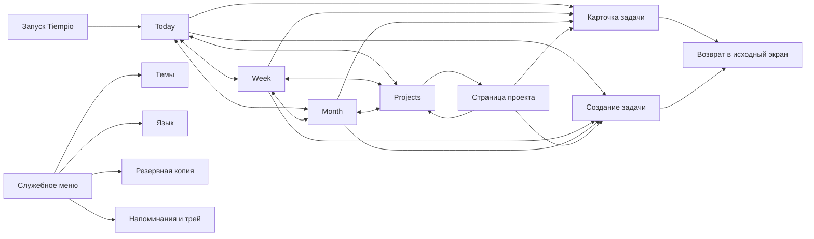

# Tiempio — карта экранов и wireframes Этапа 0

**Статус:** утверждено для реализации  
**Связанный документ:** `PHASE-0-PRODUCT-CONTRACT.md`

## 1. Назначение

Этот документ фиксирует информационную архитектуру MVP, состав ключевых экранов
и переходы между ними. Он описывает пользовательский опыт, но не определяет
React-компоненты, маршрутизатор или структуру исходного кода.

## 2. Карта экранов



Карточка задачи и создание задачи открываются в боковой панели поверх текущего
контекста. Это не отдельные разделы основной навигации.

## 3. Общая оболочка

Все основные экраны используют одну desktop-first оболочку:

1. Интегрированная строка заголовка окна.
2. Верхняя Liquid Glass панель с брендом и кнопкой «Создать».
3. Горизонтальная навигация: Today, Week, Month, Projects.
4. Заголовок, необязательное приветствие и контекст текущего раздела.
5. Компактные фильтры по проекту и тегам там, где показываются задачи.
6. Основная рабочая область.
7. Опциональная контекстная панель задачи.

Today открывается первым после запуска. Переключение основных разделов не
изменяет данные и не создаёт отдельные копии задач.

Фильтры Today, Week и Month используют одно текущее состояние. Если пользователь
выбрал проект «Yinkie», он видит тот же срез при переходе между доской и
календарём. На странице конкретного проекта проектный фильтр уже задан контекстом.

### 3.1. Язык интерфейса

В отдельном разделе `Язык` доступны `System`, `Русский`, `English` и `Español`.
Он открывается независимо от раздела `Темы`. Смена языка применяется на текущем
экране без перезапуска и без сброса выбранной темы, фильтров или открытой
карточки.

Статусы имеют стабильные внутренние коды и локализованные подписи:

| Код           | Русский                  | English        | Español     |
| ------------- | ------------------------ | -------------- | ----------- |
| `todo`        | К выполнению             | To do          | Por hacer   |
| `planned`     | Запланировано на сегодня | Plan for today | Para hoy    |
| `in_progress` | В работе                 | In progress    | En progreso |
| `done`        | Готово                   | Done           | Completada  |

Компоненты проектируются под наиболее длинную поддерживаемую строку. Перевод
охватывает видимый текст, accessibility labels, меню, трей, уведомления и
системные диалоги. Названия задач, проектов и тегов не переводятся.

## 4. Wireframe: Today

```text
┌─────────────────────────────────────────────────────────────────────────────┐
│ Tiempio · Agile your life                                  [+ Создать]      │
│          [Сегодня]   [Неделя]   [Месяц]   [Проекты]                        │
├─────────────────────────────────────────────────────────────────────────────┤
│ Добрый день                        четверг, 23 июля                         │
│ Сегодня важно продвинуть главное.  [Все проекты ▾] [Все теги ▾]            │
├────────────────┬──────────────────┬──────────────────┬─────────────────────┤
│ К выполнению   │ На сегодня       │ В работе         │ Готово              │
│ ещё не         │ выбрано на       │ выполняется      │ завершено           │
│ запланировано  │ сегодня          │ сейчас           │                     │
│                │                  │                  │                     │
│ [Сегодня]      │ [Сегодня]        │ [В фокусе]       │ [Готово сегодня]    │
│ [Просрочено]   │ [Не хватает дня] │                  │                     │
│ [Будущее]      │ [Будущее]        │                  │ 6 старых · Показать │
│ [+ Новая       │                  │                  │                     │
│    задача]     │                  │                  │                     │
└────────────────┴──────────────────┴──────────────────┴─────────────────────┘
```

### Поведение

- В широком окне видны все четыре колонки.
- При среднем окне колонки перестраиваются в сетку 2 × 2.
- В компактном окне показывается один выбранный статус; переключатель статусов
  доступен мышью и клавиатурой.
- В каждой колонке задачи группируются визуальными маркерами срочности, но
  остаются единым отсортированным списком.
- Подложка каждой колонки темнее карточек в светлой и тёмной схемах.
- Нажатие на задачу открывает правую панель.
- Перетаскивание меняет статус; то же действие доступно через кнопки в панели.
- Полноширинное действие «Новая задача» и нажатие на свободную область `TODO`
  открывают создание со статусом `TODO`.
- Старые `Done` свёрнуты за действием «Показать все».

## 5. Wireframe: Week

```text
┌─────────────────────────────────────────────────────────────────────────────┐
│ Tiempio · Agile your life                                  [+ Создать]      │
│ [Сегодня] [Неделя] [Месяц] [Проекты]   [Все проекты ▾] [Все теги ▾]        │
├─────────────────────────────────────────────────────────────────────────────┤
│ 20–26 июля                                                                 │
│ Пн   │ Вт   │ Ср   │ Чт · сегодня │ Пт   │ Сб   │ Вс                      │
│      ├──────────── Подготовить план релиза ─────────┤                      │
│      │      ├───────── Задача на три дня ──────────┤                       │
│      │ Вокал 18:00 │     │ Вокал 15:00 │                                  │
└─────────────────────────────────────────────────────────────────────────────┘
```

### Поведение

- Многодневная задача является одной непрерывной полосой.
- Текущий день выделяется мягко, без отдельной конкурирующей панели.
- События с конкретным временем показывают его рядом с названием.
- Клик по полосе открывает задачу.
- Перетаскивание календарных полос не входит в первый релиз Week.

## 6. Wireframe: Month

```text
┌─────────────────────────────────────────────────────────────────────────────┐
│ Tiempio · Agile your life                                  [+ Создать]      │
│ [Сегодня] [Неделя] [Месяц] [Проекты]   [Все проекты ▾] [Все теги ▾]        │
├─────────────────────────────────────────────────────────────────────────────┤
│ Июль 2026                              [‹] [Сегодня] [›]                    │
│ Пн │ Вт │ Ср │ Чт │ Пт │ Сб │ Вс                                          │
│  6 │  7 │  8 │  9 │ 10 │ 11 │ 12                                          │
│ 13 │ 14 │ 15 │ 16 │ 17 │ 18 │ 19                                          │
│ 20 │ 21 │ 22 │ 23 │ 24 │ 25 │ 26                                          │
│    ├────── WritersStudio onboarding ───────┤                               │
│ 27 │ 28 │ 29 │ 30 │ 31 │    │                                              │
└─────────────────────────────────────────────────────────────────────────────┘
```

### Поведение

- Полоса продолжается через соседние дни и остаётся визуально одной задачей.
- При переходе через границу недели задача получает продолжение с тем же
  визуальным идентификатором.
- В узком окне названия дней сокращаются, а полное название задачи остаётся
  доступно при фокусе и открытии.
- Month предназначен для обзора, а не для плотного редактирования.

## 7. Wireframe: Projects

```text
┌─────────────────────────────────────────────────────────────────────────────┐
│ Tiempio · Agile your life                            [+ Новый проект]       │
│ [Сегодня] [Неделя] [Месяц] [Проекты]                                      │
├─────────────────────────────────────────────────────────────────────────────┤
│ Проекты                                                                     │
│ WritersStudio  ███████░░░  7/10   ближайший срок: 25 июля                 │
│ Yinkie         █████░░░░░  5/10   ближайший срок: 27 июля                 │
│ Английский C1  ███░░░░░░░  3/10   ближайший срок: 29 июля                 │
│ Вокал          —             2 регулярных события                           │
└─────────────────────────────────────────────────────────────────────────────┘
```

### Поведение

- Проекты показаны спокойным списком, а не dashboard из множества метрик.
- Прогресс подписан числом завершённых конечных задач, а не только цветом.
- У проекта без конечных задач процент не выдумывается; показываются регулярные
  события.
- Клик по строке открывает страницу проекта.

## 8. Wireframe: страница проекта

```text
┌─────────────────────────────────────────────────────────────────────────────┐
│ Tiempio · Agile your life                                  [+ Задача]       │
│ [Сегодня] [Неделя] [Месяц] [Проекты]                                      │
├─────────────────────────────────────────────────────────────────────────────┤
│ ← Проекты   Английский C1                            [Редактировать]        │
│ Описание, цели на год, стоимость и ссылки                                  │
│                                                                             │
│ Прогресс 3 из 10                                                           │
│ Задачи: К выполнению · На сегодня · В работе · Готово                      │
│ Регулярность: вторник 18:00 · четверг 15:00                                │
└─────────────────────────────────────────────────────────────────────────────┘
```

Страница проекта не вводит собственный workflow. Она показывает те же задачи и
статусы в контексте одного проекта.

## 9. Wireframe: панель задачи

```text
┌─────────────────────────────────────┐
│ Новая задача / Название задачи  [×] │
├─────────────────────────────────────┤
│ Название *                          │
│ Описание                            │
│ Статус                              │
│ Оценка: 1 день                      │
│ Дедлайн *                           │
│ Желательный старт: автоматически    │
│ Проект                              │
│ Теги                                │
│ Время                               │
│ Повторение                          │
│                                     │
│               [Отмена] [Сохранить]  │
└─────────────────────────────────────┘
```

### Поведение

- Панель используется и для создания, и для редактирования.
- Исходный экран остаётся виден, поэтому пользователь не теряет контекст.
- По умолчанию оценка равна одному дню, старт вычисляется автоматически,
  повторение отключено.
- При ручном изменении старта автоматический расчёт выключается явно.
- Дедлайн остаётся обязательным и валидируется до сохранения.
- В режиме редактирования доступны быстрые действия смены статуса.

## 10. Ключевые пользовательские переходы

### Создать задачу

`Любой основной экран → Создать → Заполнить обязательные поля → Сохранить → Вернуться в исходный экран`

### Спланировать на сегодня

`Today / TODO → Plan for today → Автоматическая пересортировка внутри новой колонки`

### Начать и завершить

`Plan for today → In progress → Done → Установить дату завершения`

### Проверить календарь

`Today → Week или Month → Открыть полосу → Изменить задачу → Вернуться в тот же период`

### Проверить проект

`Projects → Выбрать проект → Посмотреть прогресс и задачи → Открыть задачу`

### Создать регулярность

`Карточка задачи → Включить повторение → Выбрать дни и время → Сохранить серию`

## 11. UX-инварианты

- Закрытие панели без сохранения не меняет задачу.
- Любое изменение статуса сразу отражается во всех представлениях.
- Календарные представления никогда не создают дубликаты задач.
- Срочность рассчитывается одинаково на доске, в проекте и в календаре.
- Цвет всегда дополняется текстом или формой маркера.
- Основные действия доступны мышью и клавиатурой.
- Автоматические действия не удаляют и не скрывают незавершённую работу.
- Возврат из карточки сохраняет период, фильтры и позицию исходного экрана.
- Liquid Glass никогда не является единственным способом отделить поверхность:
  структура сохраняется без blur.
- Личное приветствие не требует аккаунта и не показывается с выдуманным именем.

## 12. Решения, подтверждённые wireframes

- Основная навигация состоит из четырёх разделов и находится в верхней панели.
- Карточка задачи — контекстная правая панель, а не отдельная страница.
- Создание и редактирование используют одну форму.
- Проекты отображаются списком с прогрессом, без корпоративного dashboard.
- Регулярные события отделены от конечного прогресса проекта.
- Week и Month в первом релизе ориентированы на просмотр.
- Компактный Today показывает один статус с явным переключателем, а не длинную
  последовательность всех колонок.
- Подложки колонок темнее карточек во всех темах и схемах.
